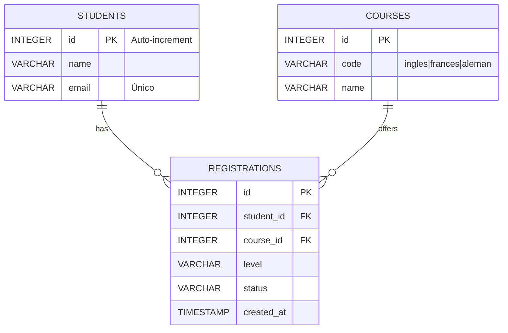

Descripción breve
-----------------
- `STUDENTS`: almacena datos personales básicos. `email` debe indexarse y, preferiblemente, ser único.
- `COURSES`: lista de idiomas/servicios ofrecidos (Inglés, Francés, Alemán).
- `REGISTRATIONS`: registro de inscripciones; relaciona `students` con `courses`, incluye `level` y `status`.
